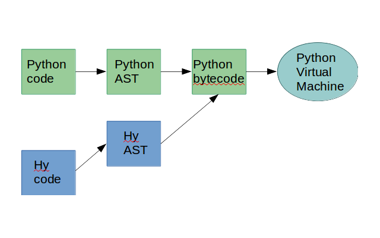

# (= Hy (+ Python Lisp))

#### Spreading parens <3 with Python

**-> For more background on this project, check [this](/INTRO.md).**

Look at that CUTE mascot by [Karen Rustad Tölva](https://twitter.com/whoisaldeka):


### Content

* [About Lisp](#about-lisp)
* [Intro to Hy](#intro-to-hy)
* [A Hy programme](#a-hy-programme)
* [Hy under the hood](#hy-under-the-hood)
* [Other features](#other-features)
* [Refs](#references)
* [Tools](#tools)

### About Lisp

Formely LISP for "LISt Processor".

It was specified in 1958 which makes it the second oldest high-level programming
language still in use today (after Fortran).
Influenced by [lambda calculus](https://en.wikipedia.org/wiki/Lambda_calculus), Lisp was created as a practical mathematical notation for computer programs and became the most widely used language in artificial intelligence research.

Lisp syntax is characterised by parenthesized lists where the function is the first element and is followed by its arguments:
```
(function argument1 argument2)
```
Today several Lisp dialects are used for general purpose (web development, data engineering...); [Common Lisp](https://common-lisp.net/), [Scheme](http://www.schemers.org/), [Clojure](http://clojure.org/)... and Hy =)

### Intro to Hy

[Hy](https://github.com/hylang/hy) is a Lisp dialect that converts its structure to Python, allowing to explore Lisp within leaving the comfort of Python.

Willing to give it a go? You can [try Hy](https://try-hy.appspot.com/) in your browser!
It's as easy as `(print "hello world")`.
And calculations go from
```
(3.5 + 5.1 + 4.6) / 3
```
to
```
(/ (+ 3.5 5.1 4.6) 3)
```
Now use the [Quickstart](http://docs.hylang.org/en/latest/quickstart.html) guide to install Hy in a virtual environment and write your first Hy programme in a `.hy` file!

In Hy you have access to all of Python data structures and the standard library.

Example 1: for loop

```
=> (for [i (range 10)]
	(print (+ "Count is " (str i))))

Count is 0
Count is 1
Count is 2
Count is 3
Count is 4
Count is 5
Count is 6
Count is 7
Count is 8
Count is 9

```

Example 2: function definition

```Hy
(defn fizzbuzz [num]
  (for [n (range 1 num)]
    (cond
     [(= 0 (% n 15)) (print n "fizzbuzz")]
     [(= 0 (% n 3)) (print n "fizz")]
     [(= 0 (% n 5)) (print n "buzz")])))
```
```Hy
=> (fizzbuzz 16)
3 fizz
5 buzz
6 fizz
9 fizz
10 buzz
12 fizz
15 fizzbuzz
```

See [try\_hy.hy](/try_hy.hy)


### A Hy programme

Analyse the content of texts, using free ebooks from the [Gutenberg project](https://www.gutenberg.org/wiki/Main_Page).

See [text\_analysis.hy](/text_analysis.hy)

For this script I need to import the modules `os`, `re`, `pprint` and the method `Counter` from the module `collections`. Here's what a Hy import statement looks like:
```
(import os re pprint [collections [Counter]])
```

This programme when called from the command line
```./text_analysis.hy "data/"```
runs an analysis for all text files in the `"data/"` directory.

Here's what the analysis function looks like:

```Hy
(defn analyse-texts [dirpath]
  (setv text-files (list-text-files dirpath))
  (list (map (fn [f]
               (setv filename f)
               (-> f
                   read-text
                   clean-text
                   remove-stopwords
                   (summarise-text filename)))
             text-files)))
```

The first step is creating a list of all the text files in the directory:
```Hy
(defn list-text-files
  [dirpath]
  "Takes in a directory path and returns
   a list of text files in that directory."
  (list-comp (os.path.join dirpath files) ;; get the full file path
             (files (list (filter ;; keep files w/ .txt extension
                           (fn [f] (.endswith f ".txt"))
                           (os.listdir dirpath))))))
```
This function uses list comprehension with `list-comp`. The second part selects all items with a ".txt" extension in the directory provided. The first part transforms each element to return the full path for each file.

It then maps over the list of text file to apply the steps of the analysis on each text file.
This is done with a threading macro and more precisely the "thread first" macro, represented by a single arrow `->`. It's the equivalent of several level of nesting but is easier to read.
Each file `f` is read, cleaned, has its stopwords removed and then summarised.

A main function can be defined to be called from the command line with the arguments provided, by using `defmain`:
```Hy
(defmain [&rest args]
  (-> args
      (get 1)
      analyse-texts
      pprint.pprint))
```

Here's the output:
```
$~ ./text_analysis.hy "data"

[{u'filename': 'data/gutenberg_peterpan.txt',
  u'most-frequent': [(u'he', 1054),
                     (u'she', 598),
                     (u'they', 585),
                     (u'had', 508),
                     (u'you', 484)],
  u'total-words': 34625},
 {u'filename': 'data/gutenberg_alice.txt',
  u'most-frequent': [(u'she', 537),
                     (u'said', 458),
                     (u'i', 398),
                     (u'alice', 385),
                     (u'you', 359)],
  u'total-words': 19223},
 {u'filename': 'data/test_ebook.txt',
  u'most-frequent': [(u'she', 6),
                     (u'one', 6),
                     (u'her', 6),
                     (u'wendy', 4),
                     (u'you', 4)],
  u'total-words': 146}]
```

### Hy under the hood

Hy compiles down to Python bytecode.
It is first translated to a Python AST and then built into Python bytecode.




#### Some definitions
**Basic steps of compilation:**
Lexing → lexical analysis: breaks up the code into tokens
Parsing → syntax analysis: convert a sequence of tokens into a parse tree
Code generation → translate the parse tree into bytecode

**AST** = Abstract Syntax Tree
It's a tree representation of the abstract syntactic structure of the source code.
This data structure is used by compilers. It is usually the results of the syntax analysis or parsing step.
It doesn't contain inessential information and contains extra information about the program.


#### Steps of Hy -> Python
**Lexing and parsing**

The code for this step is defined in [`hy.lex`](https://github.com/hylang/hy/tree/master/hy/lex) and relies heavily on the [rply](https://github.com/alex/rply) project parser.
The `LexerGenerator` from rply enables to define rules using regular expressions. In this case it's used in [`hy.lex.lexer`](https://github.com/hylang/hy/blob/master/hy/lex/lexer.py)
which defines the Hy grammar, like:
```Python
from rply import LexerGenerator


lg = LexerGenerator()

lg.add('LPAREN', r'\(')
lg.add('RPAREN', r'\)')
```

The `ParserGenerator` from rply uses the rules defined in the lexer and enables to defines other rules (called production rules) to handle the parsing of the tokens, see [`hy.lex.parser`](https://github.com/hylang/hy/blob/master/hy/lex/parser.py).
Example of a production rule for handling strings:
```Python
@pg.production("string : STRING")
@set_boundaries # Identify the start/end of the string
def t_string(p):
    # remove trailing quote
    s = p[0].value[:-1]
    # get the header
    header, s = s.split('"', 1)
    # remove unicode marker
    header = header.replace("u", "")
    # build python string
    s = header + '"""' + s + '"""'
    return uni_hystring(s)
```

Using the generated lexer and parser, here are examples of returned tokens:
```Python
> from hy.lex.lexer import lexer
> from hy.lex.parser import parser

> parser.parse(lexer.lex("foo"))
[u'foo']

> parser.parse(lexer.lex("(defn plus-two [n] (+ 2 n))"))
[(u'defn' u'plus_two' [u'n'] (u'+' 2L u'n'))]

```

**Hy AST -> Python AST**

The method [`HyASTCompiler.compile`](https://github.com/hylang/hy/blob/master/hy/compiler.py#L430) is called on the Hy models.
It try to get the type by seing if any methods that can build the `type()`. For the example of a string Hy AST is easily mapped to Python AST.
The `compile_string` method takes the input `HyString`, and returns an `ast.Str()`.

**Compilation to Python bytecode**

Once the Python AST is complete, it is compiled to Python bytecode usin the [`eval()`](https://docs.python.org/2/library/functions.html#eval) function.

### Hy Macros

Lisps are well known for the their macros. Lisp's macros enable you to extend the syntax of the language beyond the standard library.
They convert Lisp forms into different forms before compiling them. And they're considered as a tool to write clear, elegant code by
hiding away a layer of complexity.

You can define your own macros, but by using a Lisp it's very likely to use pre-defined macros.
Like other Lisps, Hy enables to define macros by using `defmacro`.
Here's a simple example for the `when` macro:
```Hy
(defmacro when [test &rest body]
  "Execute `body` when `test` is true"
  `(if ~test (do ~@body)))
```

Below is an example of writing your own macro.
I chose to modify `when` to create `when-int`:
```
(defmacro when-int [value &rest body]
  “Execute `body` when `value` is an integer”
  `(if (integer? ~value) (do ~@body)))
```

Both the thread first (`->`) and thread last (`->>`) macros are also (like for Clojure) defined as macros.
Let's have a look at the `->`:
```Hy
(defmacro -> [head &rest rest]
  "Threads the head through the rest of the forms. Inserts
   head as the second item in the first form of rest. If
   there are more forms, inserts the first form as the
   second item in the second form of rest, etc."
  (setv ret head)
  (for* [node rest]
    (if (not (isinstance node HyExpression))
      (setv node `(~node)))
    (.insert node 1 ret)
    (setv ret node))
  ret)
```

So far my favourite macro in Hy is the `defmain` as it reproduces the `“if __name__ == '__main__'”`:
```Hy
(defmacro defmain [args &rest body]
  "Write a function named \"main\" and do the if __main__ dance"
  (let [retval (gensym)
        mainfn `(fn [~@args]
                  ~@body)]
    `(when (= --name-- "__main__")
       (import sys)
       (setv ~retval (apply ~mainfn sys.argv))
       (if (integer? ~retval)
         (sys.exit ~retval)))))
```
____

#### References:

* [Lisp](https://en.wikipedia.org/wiki/Lisp_%28programming_language%29) wikipedia page
* [Why Lisp?](http://www.gigamonkeys.com/book/introduction-why-lisp.html)
* More on [(Common) Lisp](http://www.gigamonkeys.com/book/syntax-and-semantics.html)
* [Hy's docs](http://docs.hylang.org/en/latest/)
* [More docs](https://github.com/hylang/hy/blob/master/docs/language/api.rst)
* [Hy's source code](https://github.com/hylang/hy)
* [Podcast.\_\_init\_\_ episode 23](http://pythonpodcast.com/hylang-developers.html)
* [Videos and blogposts](https://gist.github.com/Eleonore9/6ae886f4ac3a70cbcb28852bc8f6a255)
* [Compiler](https://en.wikipedia.org/wiki/Compiler) wikipedia page
* [Abstract Syntax Tree](https://en.wikipedia.org/wiki/Abstract_syntax_tree) wikipedia page
* [Lisp's macros](http://www.gigamonkeys.com/book/macros-standard-control-constructs.html)
* [Writing macros](http://www.braveclojure.com/writing-macros/) in Clojure

#### Tools:
* [Emacs Hy-mode](https://github.com/hylang/hy-mode)
* [Vim-hy](https://github.com/hylang/vim-hy)
* [Jupyter kernel for Hy](https://github.com/bollwyvl/hy_kernel/)
* [Code analyser](https://github.com/hylang/hydiomatic)
* [Hy debugger](https://github.com/hylang/hdb)
